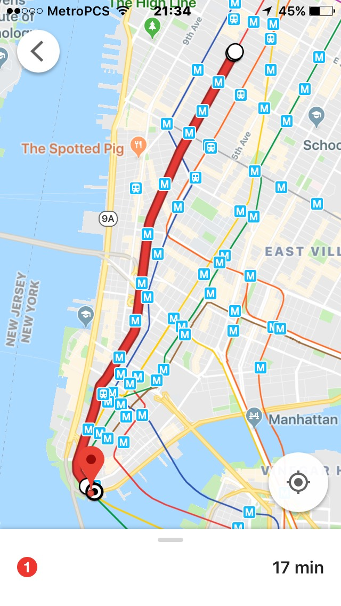

# Bothe Family NYC Guide

## Places to go, things to see

### Staten Island Ferry

This is the free ferry that passes by the statue of liberty. It leaves from the Whitehall Ferry Terminal alllllll the way downtown in Manhattan. The round-trip is about an hour. It departs every ten or fifteen minutes. It looks like this:

### Walk over The Brooklyn Bridge

Highly recommended! One of several bridges connecting Brooklyn and Manhattan. Best free views of the city. There are several ways to do this:

* **From Brooklyn** If you want to walk the entire length of the bridge, you should take the subway to the High Street/Brooklyn Bridge station in Brooklyn, then walk back toward Manhattan. The walk will be about 45 minutes. Also the Brooklyn Bridge park at the base of the bridge on teh Brooklyn side is very nice with great views.

* **From Manhattan** If you don't want to walk for so long, you can take the subway to the Brooklyn Bridge/City Hall Station at the base of the Manhattan side of the bridge, and just walk up a bit and come back. You could also just walk from the Whitehall Ferry Terminal to the Manhattan-side of the bridge, but it would be about 15 or 20 minutes walking.

### Chinatown

Five-minutes walk north of the Brooklyn Bridge in Manhattan, A GREAT neighborhood to just walk around and feel like you are in another world. VERY different, VERY unique, and VERY cheap. If you aren't feeling adventurous enough to eat a full meal there, at least check out one of the bakeries for some delicious pasteries. I can vouch for Lung Moon Bakery on Mulberry Street (Google it!). The little custard pies (center in pastry photo below) are AMAZING!

### Recap Map

### Central Park

If you have time and are feeling ok about riding the subway, you can head back uptown and check out another location that used to be shady but is now one of the nicest/safest places in NYC. Head to Grand Army Plaza in Manhattan (not Brooklyn) and then walk through the Park to the Bethesday Fountain, making sure to follow the path the leads down the Mall/Literary Walk.

## How to use the subway

### Basics

* A Youtube video on [How to buy a ticket (aka, MetroCard)](https://www.youtube.com/watch?v=wgZ3KgLsf60). Hold onto the first metro card you buy, and then add credit to it for the rest of the day. The card itself cost $1, so don't lose it!

* Pay attention to whether you need to be on a "local" train or an "express" train. Google maps (or whichever app you chose) should help you with that.

### Examples of using Google maps to navigate public transport

